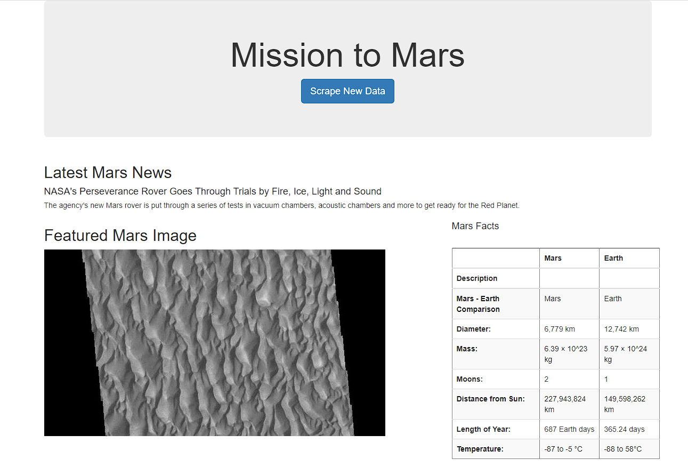
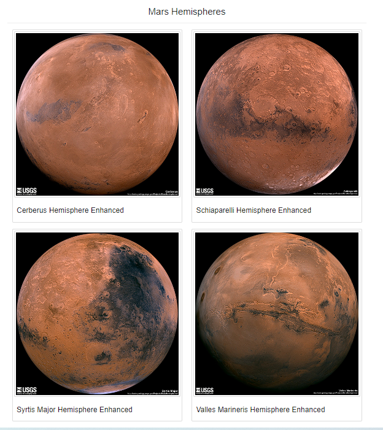

# Mission-to-Mars
## Overview
Create a collection of Mars information by scraping several websites for Mars data. Using python and it's libraries that is mobile responsive. 

## Resources
Software: Visual Studio Code 1.69.2, Python 3.7.13, Jupyter Notebook 6.4.8, Anaconda 4.13.0, MongoDB 6.0.0, HTML, Jinja Templating
Python Libraries: pandas, datetime, bs4, splinter, webdriver_manager, flask, flask_pymongo

## Results

Image of Mars Scraping Website

